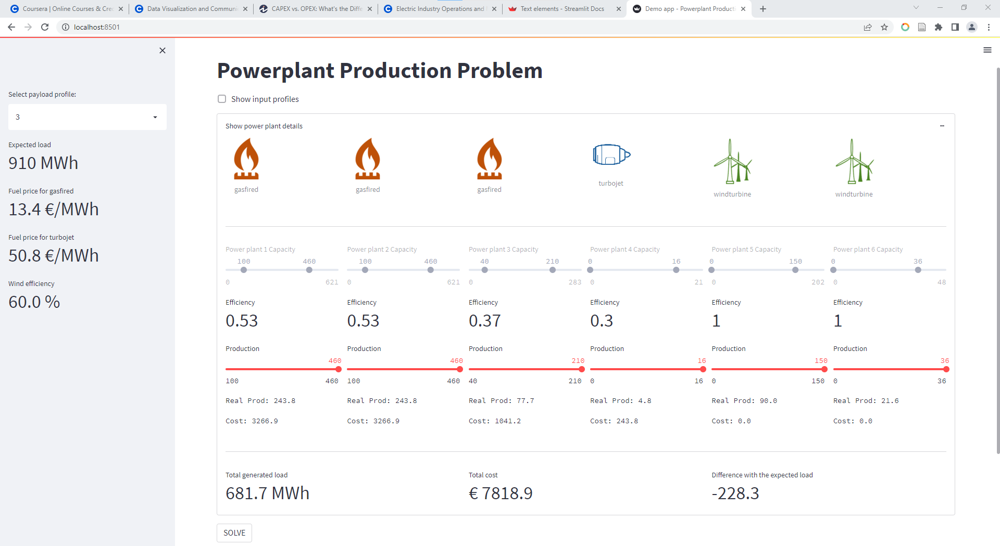

# powerplant-coding-challenge

A dead simple solution for the coding challenge, without any third party library, and can be run on github codespace.
(Press dot key <kbd>.</kbd> to activate the codespace in this repo.)

## Solution source code walkthrough

+ The entry point is on the [`endpoint.py`](endpoint.py), which is a custom `HTTPServer` runing on port `8888`
  + Run the server: `python endpoint.py`.
  + The endpoint is defined based on the `BaseHTTPRequestHandler` to handle POST requests.
  + The POST request is expected to point to `/productionplan` with a json payload, e.g.,

    ```bash
    curl -X POST localhost:8888/productionplan \
      -H "Content-Type:application/json" \
      -d @example_payloads/payload1.json
    ```

+ The input payload is parsed by the `utils.parse_payload` function in the [`utils`](utils.py) module.
+ When having information about the expected load and the profiles of each powerplant, the core algorithm in `solver.greedy_solver` is called. The workflow of creating response message and logging are handled in `create_response()` function in `endpoint.py`.

## Algorithm

+ The powerplants needed to be dispatched according to the merit order, which is also called the ecomonic order. The powerplant with lowest operation cost will be dispatched first while the ones with higher costs will be dispatched later. This merit order makes sure the total operation cost (fuel cost) is minimized.

+ A greedy algorithm (in the [`solver`](solver.py) module) can be used to implement this merit order dispatching strategy:
  + The powerplants are sorted by their operation cost (fuel price).
  + If two powerplants have the same cost, the one with higher efficiency is dispatcher first.

+ Looping through the merit order, each powerplant generates load as follows:
  + A plant with zero efficiency (e.g., wind turbine while there is no wild) is ignored.
  + Calculate how much power should be generated from the current power plant to meet the expectation.
  + Cap the generated load by the powerplant capacity (`pmin`, `pmax`).
  + If the generated load is smaller than the minimum capacity, it is ignored.

+ The algorithm terminates when we meet the expected load or when all powerplants are dispatched.
  + If the actual generated load is not equal to the expected load, the problem is considered as not solved.

+ $\text{C0}_2$ cost: 0.3 ton per MWh * $\text{C0}_2$ price (e.g., 20 € per ton) will be added to the cost to generate 1MWh from gas besides the gas price. It can be implemented as

```python
cost_per_1MWh_electricity = (get_price(powerplant_type) + 
                             0.3 * get_co2_price(powerplant_type) if CO2 else 0)
```

where `get_co2_price = lambda ptype: get_price("co2") if ptype == "gasfired" else 0`.

+ An important assumption (may not be true in practice): if the power needed to generate is smaller than the minimum capcity of the powerplant, this powerplant will not be activated.
  + E.g., if we need to generate 20 MWh with a powerplant having capacity of [30 Mwh - 100 MWh], we would not activate this powerplant.
  + Using this assumption, the following case (with 2 powerplants with the same efficiency) and `expected_load = 110` has not a solution.

    ||Powerplant1|Powerplant2|
    |---|---|---|
    |pmin|20|20|
    |pmax|100|100|

  When the first powerplant is active, it generates 100 MWh and lets 10 MWh remaining for the 2nd plant. However this demand is smaller than the second one's minimum capacity and thus it is not activated, leading to no solution.
  + If we use another assumption considering that the gas powerplants are always activated and generate load at their minimum capacity by default, the above case will have a solution `90` Mwh from powerplant1 and `20` MWh from powerplant2.
  This assumption is expressed naturally as `pmin <= production <= pmax` in a linear solver, but is not used in this solution. Another visual demo using a linear solver in the next section will use this assumption for simplifying the modeling step.

## Additional tasks

<details>
<summary>
A visual demo of this powerplant production problem for non-technical users and for **fun**.
</summary>



+ The interactive app is built using [`streamlit`](https://streamlit.io/). The problem is modeled as a linear programming problem and solved by a traditional simplex method implement in `scipy.optimize.linprog`.

+ Install dependencies: `pip install -r requirements.txt`
+ Run the app: `streamlit run app.py`, access via the url [`http://localhost:8501/`](http://localhost:8501/).
+ Select the profile id in the selection box on the left. The interactive GUI appears on the right, in which users can move the sliders to change the production of each powerplant.
+ A quick and dirty implementation of the GUI and logic of the app is defined in [`app.py`](app.py).

+ [ ] TODO: the interactive mode and the auto mode have not worked smoothly together. To stop the ineractive model, fefresh the GUI (re-select the profile id or <kbd>F5</kbd>) to reset the production sliders, then click <kbd>SOLVE</kbd> button to call the solver.

</details>

-------------------------------------------------------------------------------

## The original README of the GEM's coding challenge

## Welcome

Below you can find the description of a coding challenge that we ask people to perform when applying
for a job in our team.

The goal of this coding challenge is to provide the applicant some insight into the business we're in and
as such provide the applicant an indication about the challenges she/he will be confronted with. Next, during the
first interview we will use the applicant's implementation as a seed to discuss all kinds of
interesting software engineering topics.  

## Who are we

We are the IS team of the 'Short-term Power as-a-Service' (a.k.a. SPaaS) team within [GEM](https://gems.engie.com/).

[GEM](https://gems.engie.com/), which stands for 'Global Energy Management', is the
energy management arm of [ENGIE](https://www.engie.com/), one of the largest global energy players,
with access to local markets all over the world.  

SPaaS is a team consisting of around 100 people with experience in energy markets, IT and
modeling. In smaller teams consisting of a mix of people with different experiences, we are active on
the [day-ahead](https://en.wikipedia.org/wiki/European_Power_Exchange#Day-ahead_markets) market,
[intraday markets](https://en.wikipedia.org/wiki/European_Power_Exchange#Intraday_markets) and
[collaborate with the TSO to balance the grid continuously](https://en.wikipedia.org/wiki/Transmission_system_operator#Electricity_market_operations).

## The challenge

### In short

Calculate how much power each of a multitude of different [powerplants](https://en.wikipedia.org/wiki/Power_station) need
to produce (a.k.a. the production-plan) when the [load](https://en.wikipedia.org/wiki/Load_profile) is given
and taking into account the cost of the underlying energy sources (gas,  kerosine) and the Pmin and Pmax of each powerplant.

### More in detail

The load is the continuous demand of power. The total load at each moment in time is forecasted. For instance
for Belgium you can see the load forecasted by the grid operator [here](https://www.elia.be/en/grid-data/load-and-load-forecasts).

At any moment in time, all available powerplants need to generate the power to exactly match the load.
The cost of generating power can be different for every powerplant and is dependent on external factors:
The cost of producing power using a [turbojet](https://en.wikipedia.org/wiki/Gas_turbine#Industrial_gas_turbines_for_power_generation),
that runs on kerosine, is higher compared to the cost of generating power
using a gas-fired powerplant because of gas being cheaper compared to kerosine and because of the
[thermal efficiency](https://en.wikipedia.org/wiki/Thermal_efficiency) of a gas-fired powerplant being around
50% (2 units of gas will generate 1 unit of electricity) while that of a turbojet is only around 30%.
The cost of generating power using windmills however is zero. Thus deciding which powerplants to
activate is dependent on the [merit-order](https://en.wikipedia.org/wiki/Merit_order).

When deciding which powerplants in the merit-order to activate
(a.k.a. [unit-commitment problem](https://en.wikipedia.org/wiki/Unit_commitment_problem_in_electrical_power_production))
the maximum amount of power each powerplant can produce (Pmax) obviously needs to be taken into account.
Additionally gas-fired powerplants generate a certain minimum amount of power when switched on, called the Pmin.

### Performing the challenge

Build a REST API exposing an endpoint `/productionplan` that accepts a POST with a payload as you can
find in the `example_payloads` directory and that returns a json with the same structure as
in `example_response.json` and that manages and logs run-time errors.

For calculating the unit-commitment, we prefer you not to rely on an existing (linear-programming) solver but
instead write an algorithm yourself.

Implementations can be coded in either in C# or Python as these are (currently) the main languages we use in SPaaS.
Along with the implementation should be a README that describes how to compile (if applicable) and launch the application.

+ C# implementations should contain a solutions file to compile the application.
+ Python implementations should contain
a `requirements.txt` or a `pyproject.toml` (for use with poetry) to install all needed dependencies.

#### Payload

The payload contains 3 types of data:

+ load: The load is the amount of energy (MWh) that need to be generated during one hour.
+ fuels: based on the cost of the fuels of each powerplant, the merit-order can be determined which is the starting
 point for deciding which powerplants should be switched on and how much power they will deliver.
 Wind-turbine are either switched-on, and in that case generate a certain amount of energy
 depending on the % of wind, or can be switched off.
  + gas(euro/MWh): the price of gas per MWh. Thus if gas is at 6 euro/MWh and if the efficiency of the powerplant is 50%
   (i.e. 2 units of gas will generate one unit of electricity), the cost of generating 1 MWh is 12 euro.
  + kerosine(euro/Mwh): the price of kerosine per MWh.
  + co2(euro/ton): the price of emission allowances (optionally to be taken into account).
  + wind(%): percentage of wind. Example: if there is on average 25% wind during an hour, a wind-turbine
   with a Pmax of 4 MW will generate 1MWh of energy.
+ powerplants: describes the powerplants at disposal to generate the demanded load. For each powerplant.
 is specified:
  + name:
  + type: gasfired, turbojet or windturbine.
  + efficiency: the efficiency at which they convert a MWh of fuel into a MWh of electrical energy.
   Wind-turbines do not consume 'fuel' and thus are considered to generate power at zero price.
  + pmax: the maximum amount of power the powerplant can generate.
  + pmin: the minimum amount of power the powerplant generates when switched on.

#### response

The response should be a json as in `example_response.json`, specifying for each powerplant how much
power each powerplant should deliver. The power produced by each powerplant has to be a multiple
of 0.1 Mw and the sum of the power produced by all the powerplants together should
equal the load.

### Want more challenge?

Having fun with this challenge and want to make it more realistic. Optionally, do one of the extra's below:

#### Docker

Provide a Dockerfile along with the implementation to allow deploying your solution quickly.

#### CO2

Taken into account that a gas-fired powerplant also emits CO2, the cost of running the powerplant should
also take into account the cost of the [emission allowances](https://en.wikipedia.org/wiki/Carbon_emission_trading).
For this challenge, you may take into account that each MWh generated creates 0.3 ton of CO2.

#### Websocket

Provide a websocket server connection that will emit after every post the input of the POST together with
the response to every client connected on the websocket.

## Acceptance criteria

For a submission to be reviewed as part of an application for a position in the team, the project
needs to:

+ contain a README.md explaining how to build and launch the API
+ expose the API on port `8888`
+ return a result where the sum of the power generated by each of the different powerplants is
  exactly equal to the load specified in the payload for at least the example payloads provided.

Failing to comply with any of these criteria will automatically disqualify the submission.

## More info

For more info on energy management, check out:

+ [Global Energy Management Solutions](https://www.youtube.com/watch?v=SAop0RSGdHM)
+ [COO hydroelectric power station](https://www.youtube.com/watch?v=edamsBppnlg)
+ [Management of supply](https://www.youtube.com/watch?v=eh6IIQeeX3c) - video made during winter 2018-2019

## FAQ

##### Can an existing solver be used to calculate the unit-commitment

Implementations should not rely on an external solver and thus contain an algorithm written
from scratch (clarified in the text as of version v1.1.0)
